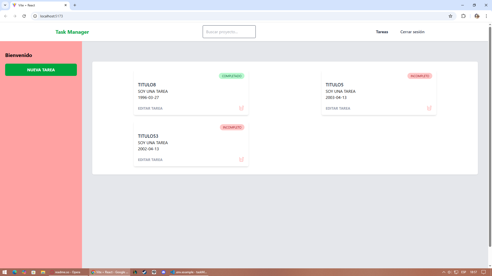
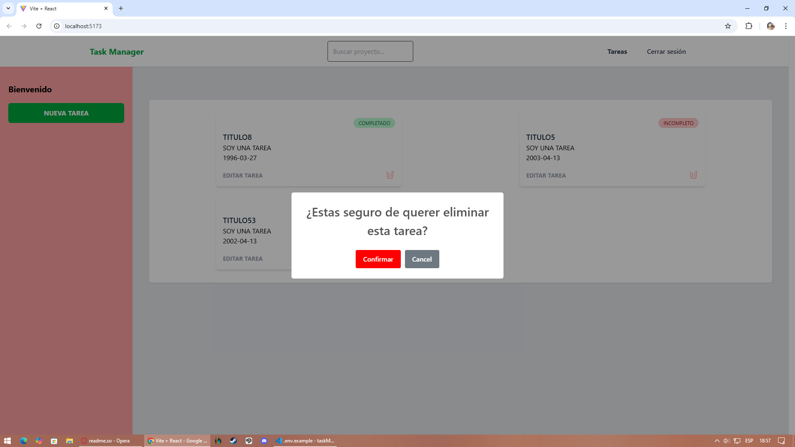
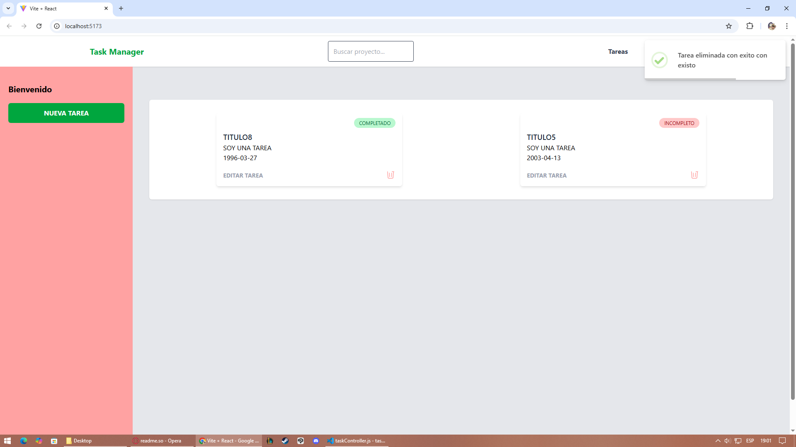
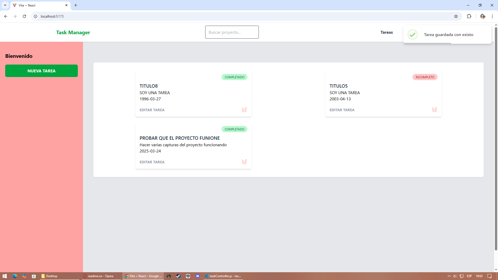
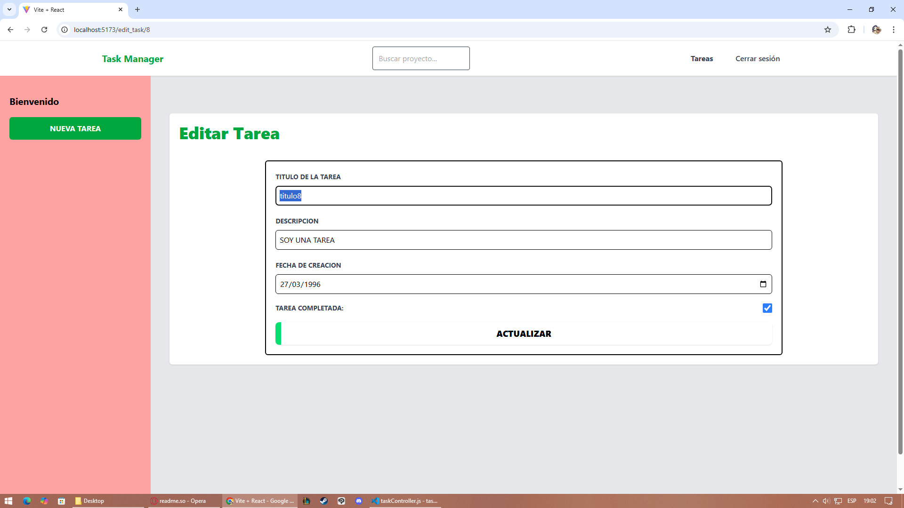
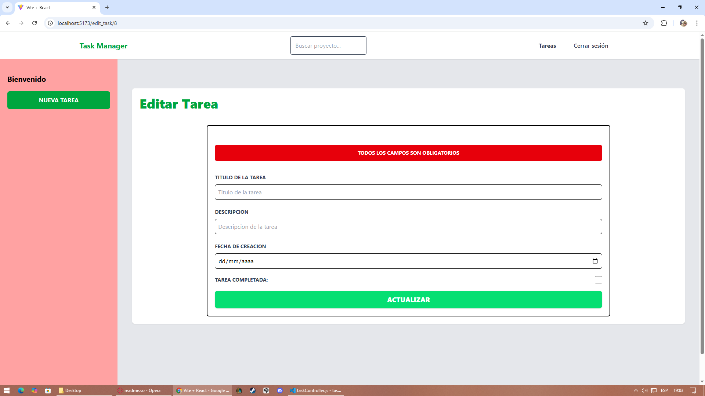
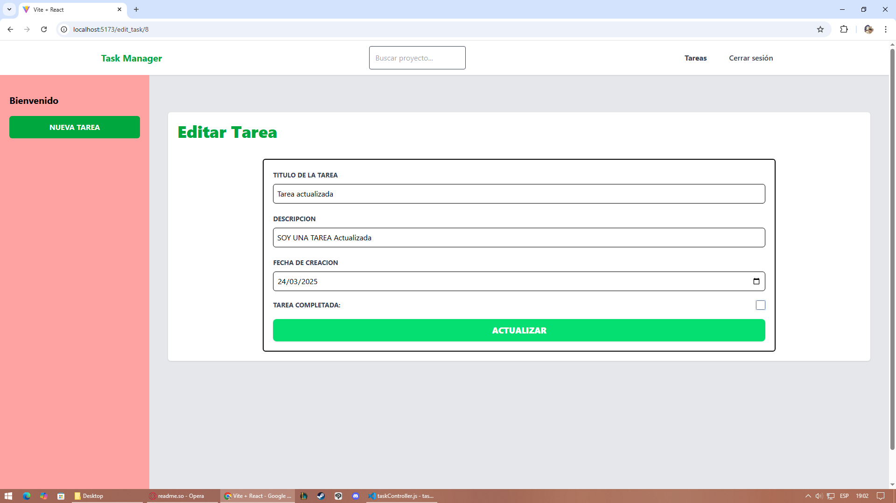
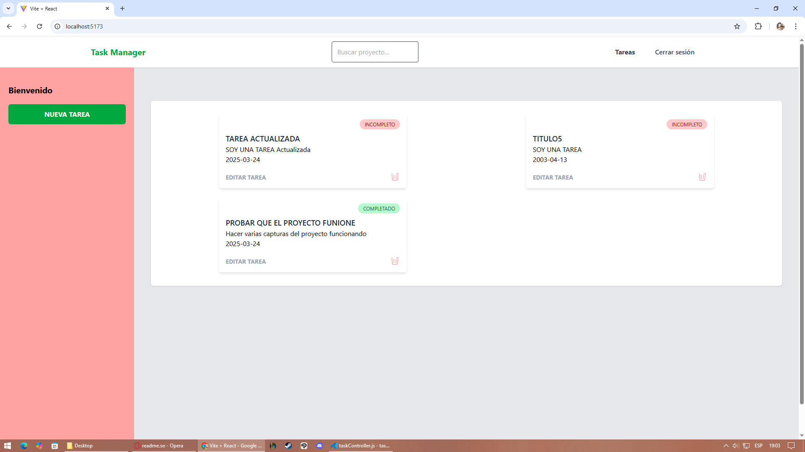
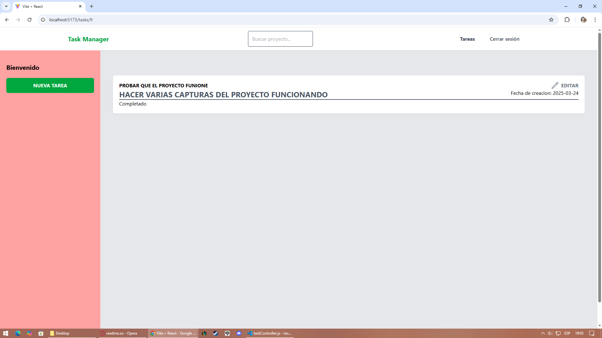

# Task Manager

Este es un proyecto de Task Manager que consta de dos partes principales: el backend (servidor de Express) y el frontend (aplicación de React). A continuación se detallan las instrucciones para ejecutar ambos componentes localmente.


## Requisitos Previos

1. Tener instalado Node.js.

2. Tener instalado Git (si deseas clonar el repositorio).

## Instrucciones para ejecutar el proyecto localmente

1. Clonar el repositorio

Clona este repositorio en tu máquina local:


## Instrucciones para ejecutar el proyecto localmente

1. Clona este repositorio en tu máquina local:

```bash
git clone https://github.com/JuanSilva27/taskManager.git
```
## Configuración del entorno

### Backend

1. Navega a la carpeta taskManager 

```bash
cd taskManager
```

2. Instala las dependencias del **Backend**

```bash
npm install
```

3. Crea un archivo `.env` en la raiz del proyecto Backend con la siguiente variable de entorno:

```bash
PORT=3000
```

### Frontend

1. Navega a la carpeta **client** :
```bash
cd client
```

2. instala las dependencias del **Frontend**
```bash
npm install
```
3. Crea un archivo `.env` dentro de la carpeta **client** con la siguiente variable de entorno: 
```bash
VITE_API_URL=http://localhost:3000/api
```

## Ejecutar el proyecto

Para ejecutar el proyecto completo, utiliza el siguiente comando en la carpeta raíz del proyecto (**taskManager**):

```bash
npm run dev
```

Esto iniciará tanto el servidor del **Backend** como la aplicación de **Frontend** de manera simultanea.

## Accesso a la aplicación

- **Backend**:La API estará disponible en http://localhost:3000/api
- **Frontend**: La aplicación de React estará disponible en http://localhost:5173.

## Endpoints disponibles (Backend)

- **GET /api/tasks**: Obtener todas las tareas.
- **POST /api/tasks**: Crear una nueva tarea.
- **GET /api/tasks/:id**: Obtener una tarea especifica.
- **PUT /api/tasks/:id**: Actualizar una tarea existente.
- **DELETE /api/tasks/:id**: Eliminar una tarea.

## Cómo probar la aplicación
1. Abre el navegador y navega a http://localhost:5173 para interactuar con la interfaz de usuario.

2. Utiliza la API de tareas, que se conecta automáticamente con el backend en http://localhost:3000/api.

## Vista Principal


- Si le damos click al icono de eliminar aparecera un letrero para confirmar si de verdad queremos eliminar la tarea


- Si se le da a confirmar, la tarea sera eliminada y aparecera un pequeño cartel que nos lo confirma


## Formulario de Creacion de Tarea


- Una vez la tarea sea creada correctamente, se nos redirigira a la pagina principal donde estara la nueva tarea que acabamos de agregar



## Formulario de Edicion de Tarea



- No premite campos vacios



- Ejemplo correcto de una tarea editada



- La tarea a sido actualizada con exito



## Vista individual de una tarea    

